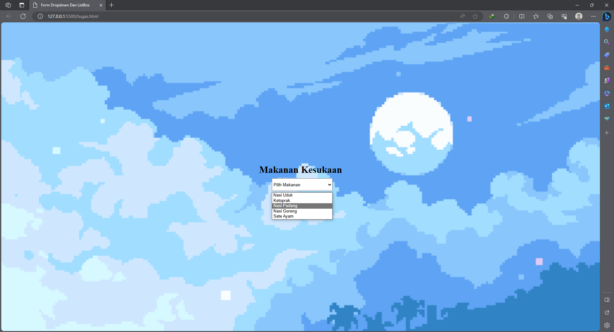

#Lab3Web

## Persiapan membuat dokumen HTML dengan nama file lab3_list.html seperti berikut

## Membuat Unorderd List

## Membuat Description List

## Membuat Tabel

## Mengatur Margin dan Padding

## Membuat Form

## Menabahkan Style pada Form

## Pertanyaan dan Tugas

1. Buatlah form yang menampilkan dropdown menu dan listbox dengan multiple selection.

